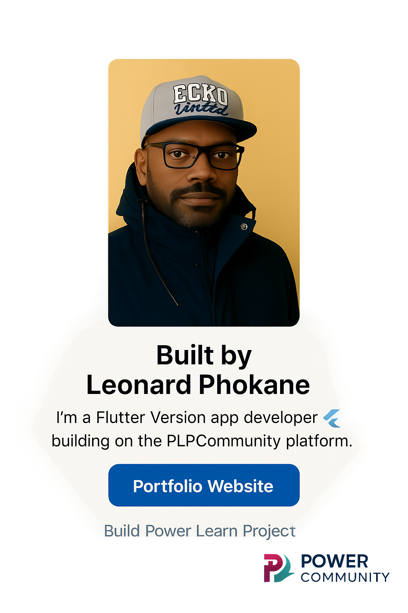
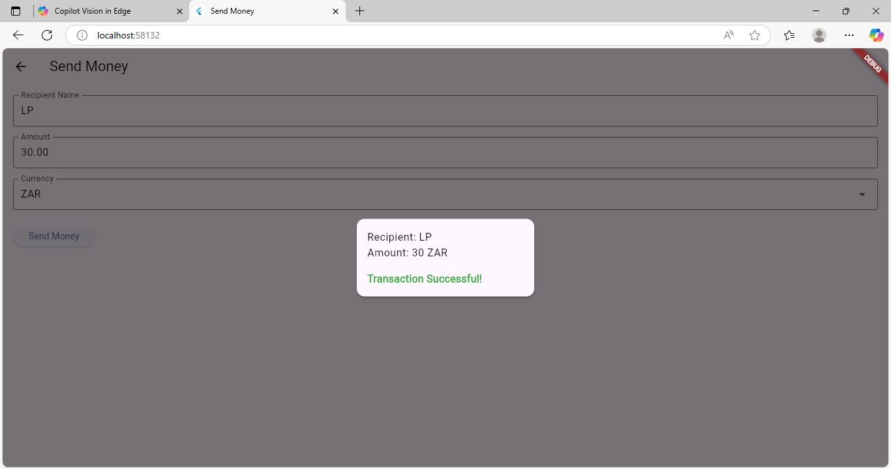
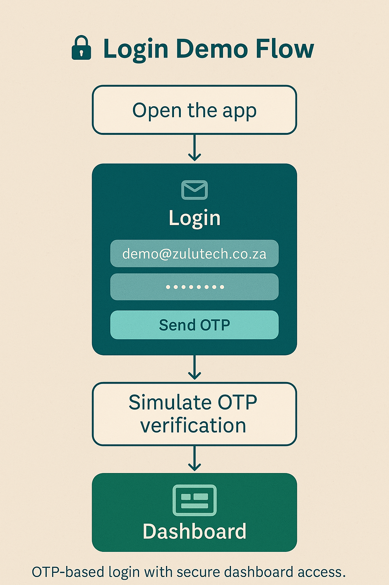
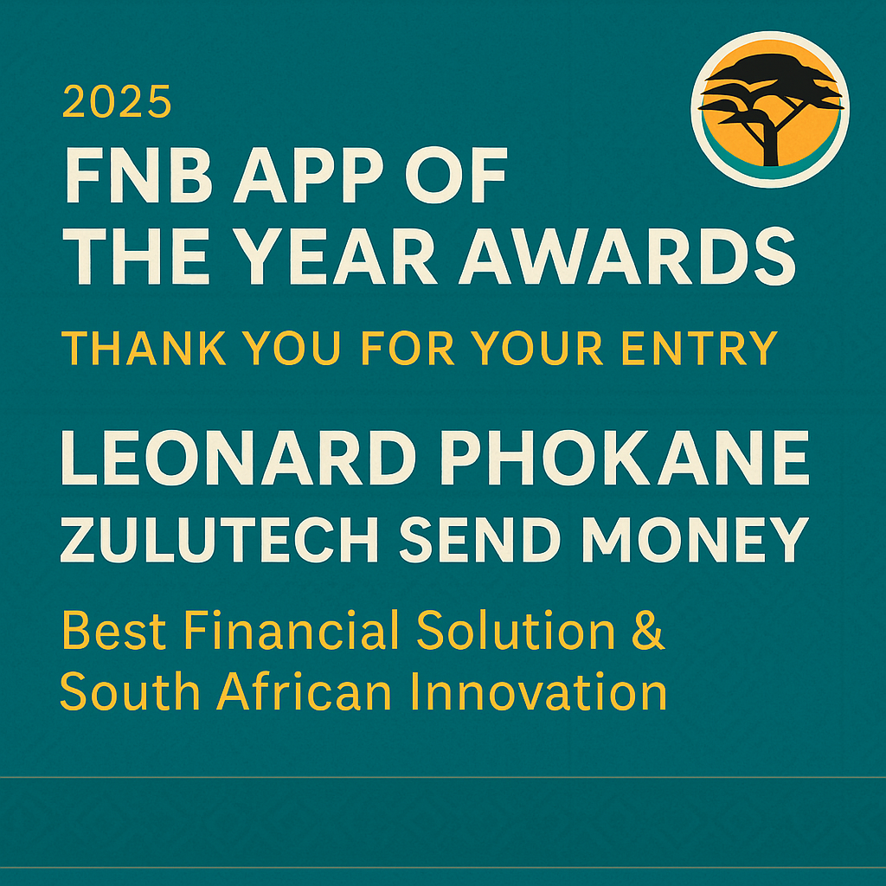
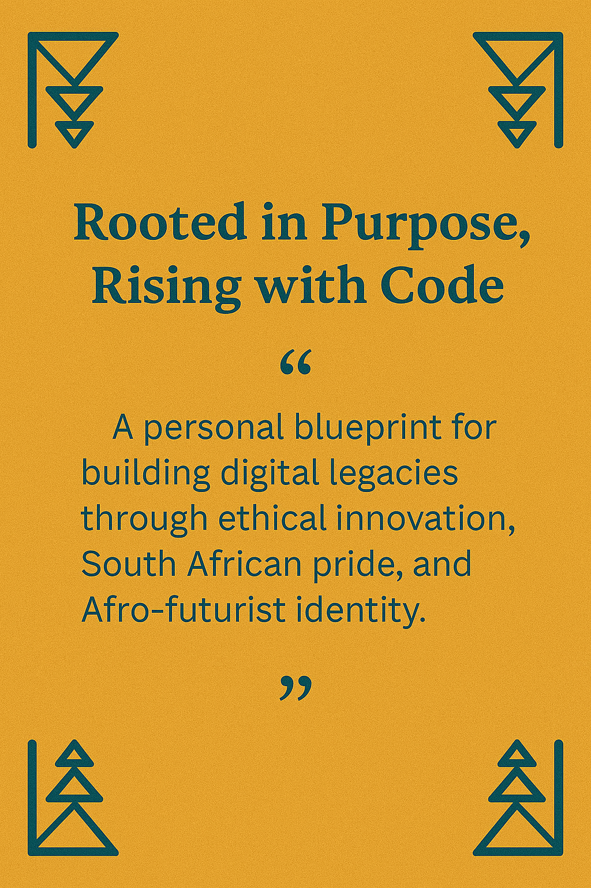
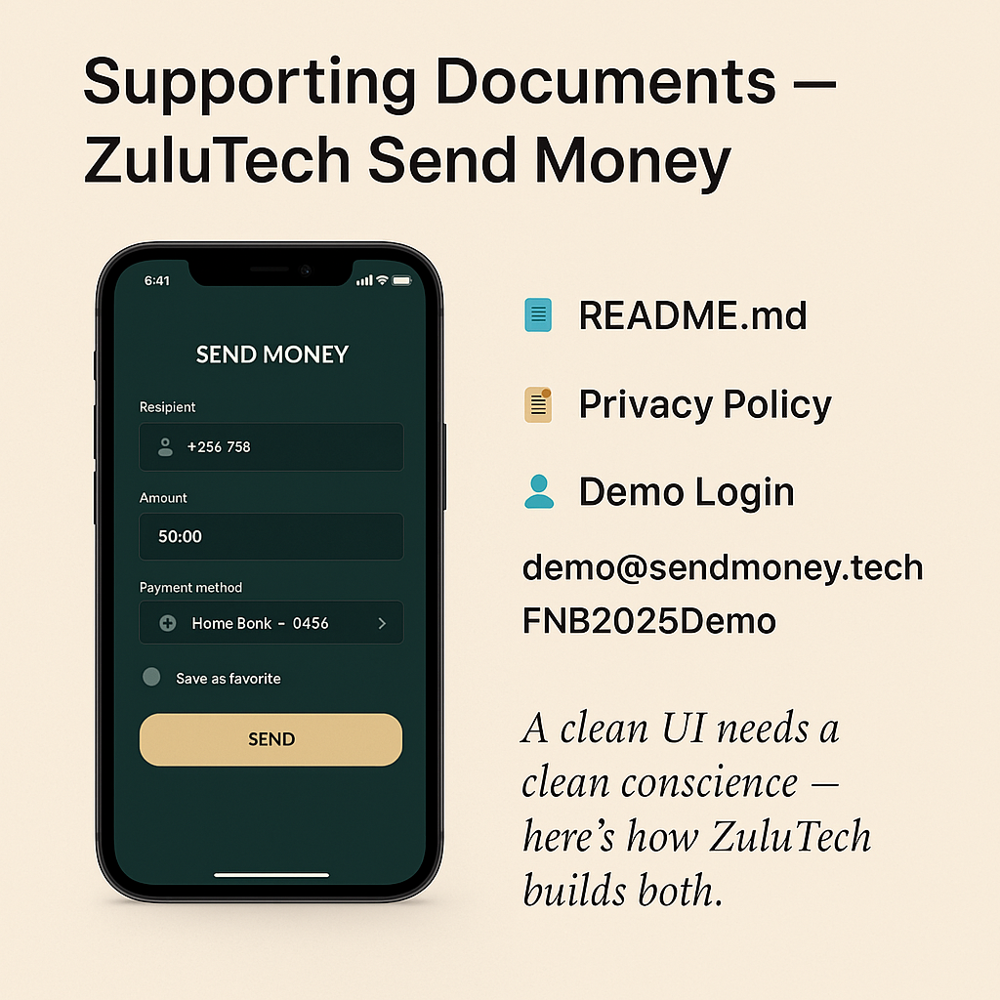
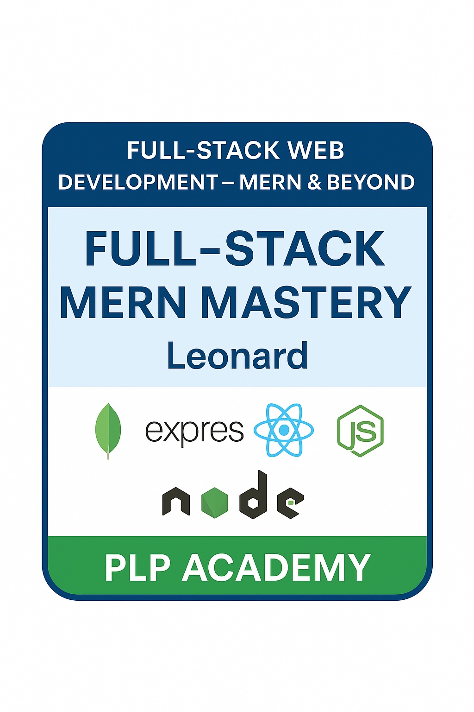

# 🧭 Who is Leonard Phokane?

> *“From village chalkboards to fairness algorithms, my story is proof that purpose fuels progress — and code becomes legacy.”*

Leonard Phokane is a visionary South African developer blending technical precision with cultural storytelling.  
Founder of **ZuluTech**, creator of **Fairness Inspector**, and builder of platforms like **KaziLink**, his work champions ethical innovation with Afro-futurist aesthetics.

---

## 🌍 Developer Identity

- ✨ **Legacy Builder** not just a coder  
- 🛠️ Fuses **Flutter**, **Ethical AI**, and **Pan-African branding**  
- 🔄 Projects rooted in **trust, inclusion, and cultural resonance**

---

# 💸 ZuluTech Send Money  
*A ZuluTech Subsection — Fintech with Soul*

> *“Transactions don’t just move money — they move stories.”*

---

## 🔐 App Features

- OTP login with Firebase  
- Modular Flutter widgets & shimmer animations  
- Currency dropdown & mock transaction feed  
- Narrative UI elements that build trust

  
  

---

## 📈 Demo Flow

  
*OTP-based login leading to secure dashboard access.*

- Enter: `demo@zulutech.co.za`  
- Tap **Send OTP**  
- Simulated login → Dashboard view

---

  
*ZuluTech Send Money entry confirmed for 2025 FNB App of the Year — Best Financial Solution & South African Innovation.*

---

## 📘 Supporting Documents

- 📄 [Who is Leonard Phokane – Compressed PDF](doc/Who is Leonard Phokane_compressed.pdf)  
- 💸 [ZuluTech Send Money – Merged Canva README](doc/merged_canva_readme.pdf)  
- 🧾 [FNB App of the Year – Submission Receipt Screenshot](assets/fnb_submission_receipt_screenshot.png)  
- 🧭   
  *A visual commitment to fairness, inclusion, and responsible innovation.*

---

## 🏆 FNB App of the Year Entry

> **Submitted for 2025 Best Financial Solution & South African Innovation**  
📥 Confirmation Received | 📅 23 July 2025

---

...
## 🔗 Explore My World

🌐 [Portfolio Website](https://leonardphokane.netlify.app)  
👨‍💻 [GitHub Profile](https://github.com/leonardphokane)  
📁 [Padlet Showcase](https://padlet.com/leonardphokane/zulutech-send-money-showcase)

---

## 🛠️ Full-Stack Web Development – MERN & Beyond

  
*Leonard's journey into the MERN ecosystem via PLP Academy.*

Leonard Phokane is a certified Full-Stack Developer with hands-on training in the MERN Stack:

| Technology   | Role                         |
|--------------|------------------------------|
| MongoDB      | NoSQL database for app data  |
| Express.js   | Backend API and routing      |
| React.js     | Dynamic UI & front-end logic |
| Node.js      | Server-side architecture     |

He’s built scalable applications using **Socket.io**, secure auth with **JWT**, and deployed using GitHub workflows, **Vercel**, and **Heroku**.

🧪 Learned:
- Data modeling & RESTful APIs  
- Real-time communication (Socket.io)  
- Deployment & DevOps fundamentals  
- Testing & debugging workflows

📈 Course: [PLP Full-Stack MERN Program](https://academy.powerlearnprojectafrica.org/module/679733b84362787f89c8a6f9)

> *“I build from the server to the shimmer — from logic layers to legacy animations.”*

  
  

---

## 🪶 License

Shared under the **Legacy License** — remixable for ethical innovation, community equity, and cultural design.

